# TCMS仿真工具使用说明 
 
## 功能说明
TCMS仿真工具主要用于模拟TCMS与被测对象建立连接进行UDP通信，以满足ICD中规定通信方式、通信数据格式等。主要功能有：选择输入文件，自定义通信参数，计数功能，清空显示功能，连接状态显示功能，接收消息显示与解析功能，消息发送功能，自定义发送功能。主界面显示如下图：
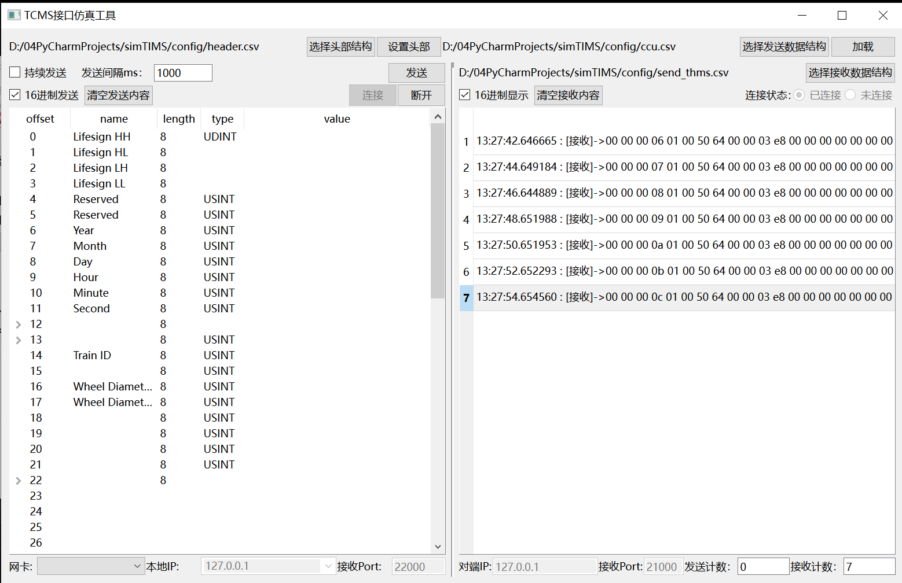

### 选择输入文件功能
选择输入文件主要包括三个文件：a.消息头部结构文件；b.接收消息自定义结构文件；c.发送消息自定义结构文件。
#### 要求
输入文件格式要求为csv文件格式。
消息头部结构的csv文件包含两列，具体如下：
Name	Offset
消息自定义结构的csv文件包含9列，与ICD文档保持一致，具体如下：
Byte Offset	Bit No.	Size	Data Type	Signal ID	Data Name	Data Description	Value Interpretation	Remark
#### 操作说明
分别点击下图中的按钮，选择对应的csv文件，即可完成输入文件选择。
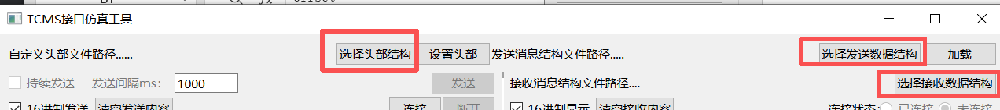

### 自定义通信参数功能
自定义通信参数主要包括自定义本地IP，自定义本地接收端口（port），自定义对端IP地址，自定义对端端口（port）。
#### 要求
无。
#### 操作说明
在主界面底部位置，分别输入本地IP，接收Port，对端IP，对端接收Port，即可完成通信参数的设置。如下图：
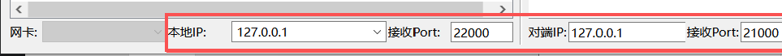

### 计数功能
在主界面底部右下方，可显示发送计数和接收计数，此处不可手动编辑。

### 清空显示
在主界面发送消息面板和接收消息面板上方各有一个“清空发送内容”按钮，分别用来清空发送消息的设置值（开发中）与接收消息面板，如下图：
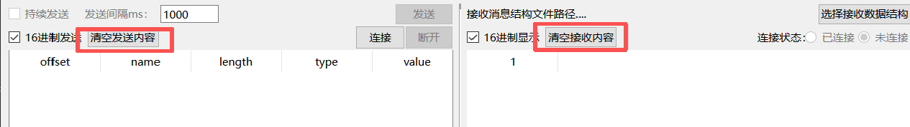
### 连接状态显示
在主界面接收消息面板右上方，可显示当前本机与对端的连接状态。
与对端建立连接时显示如下图：
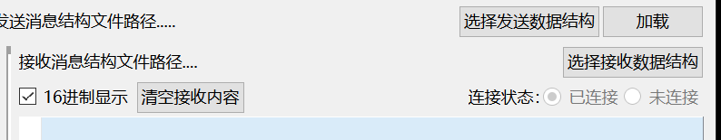
断开连接时显示如下图：
.png)

### 消息接收功能
#### 接收消息显示
在主界面中部右侧为接收消息面板，每行可依据设置显示当前接收的消息接收时间（单位到毫秒）与消息原报文（trdp头部+自定义）与，如下图：
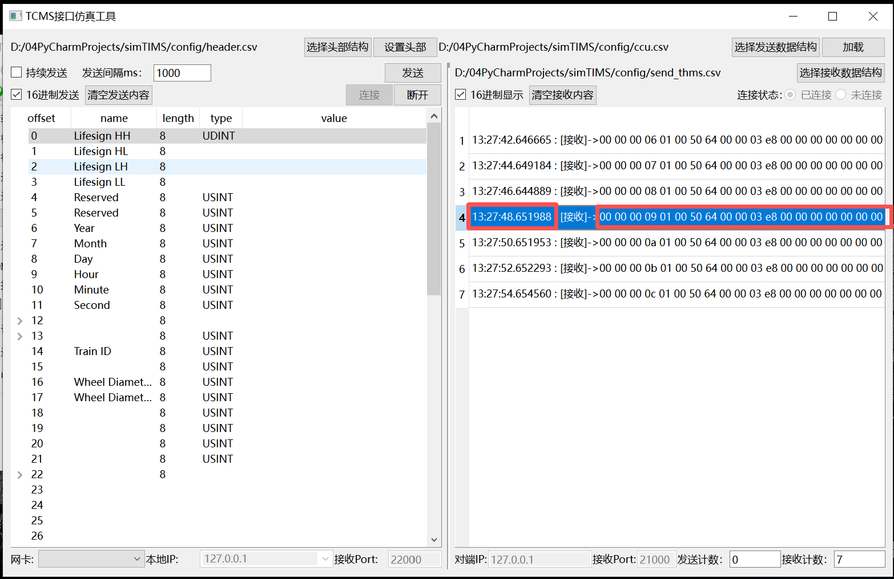
#### 接收消息解析
双击任一行接收消息，可弹出对应的解析内容，如下图：
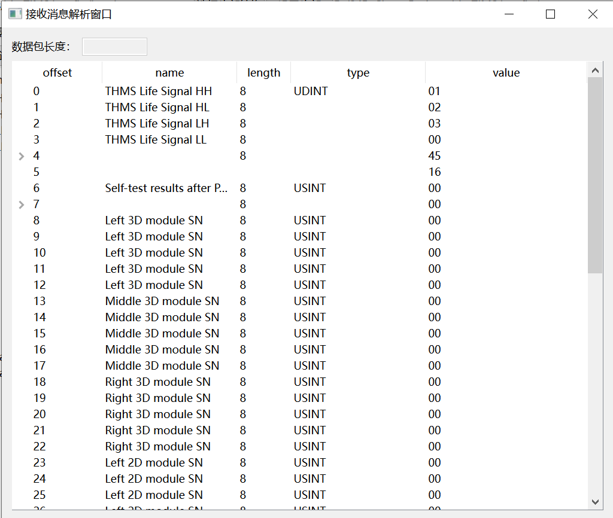

### 消息发送功能
#### 发送消息自定义部分设置
##### 要求
在主界面中部左侧为消息发送面板，此处面板显示需先选择发送数据结构csv文件后，点击“加载”按钮，方可成功加载发送消息的自定义结构，如下图：
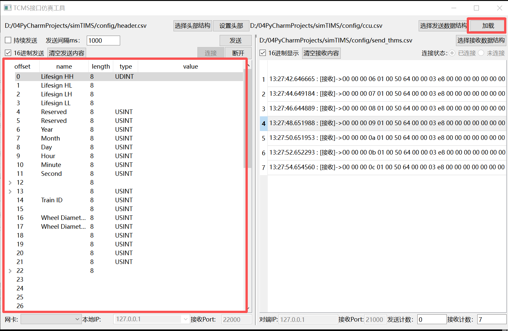
在消息发送面板中各列含义说明如下：
列名	说明
offset	代表偏移量，单位为字节
name	代表字段名称，简单表示字段作用
length	代表字段长度，单位bit位
type	代表字段类型
value	自定义发送数据，输入要求：按照type要求输入数值10进制或字母
##### 操作说明
在消息发送面板中，选择要输入的行，双击value列对应的单元格即可输入自定义数值：
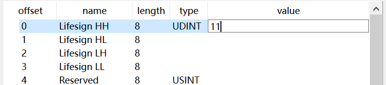

#### 发送消息头部分自定义
##### 要求
自定义发送消息头部，需先选择头部结构csv文件，然后点击设置头部按钮，弹出设置头部窗口，进行发送消息的头部数据设置，如下图：
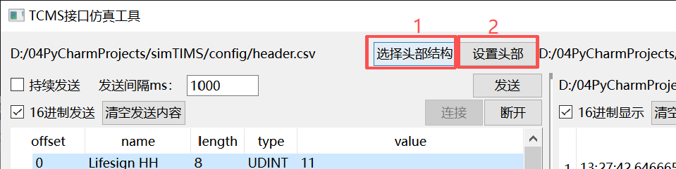
设置头部窗口各列含义说明如下：
列名	说明
name	代表字段名称，简单表示字段作用。
offset	代表该字段占用的偏移量数组，如[‘0’, ‘1’]表示占用第0和第1个字节偏移量，单位字节。
length	代表字段长度，单位字节。
Value	自定义发送数据，输入要求：按照type要求输入数值10进制或字母。
Option	可选操作。
None ：无操作，缺省选项；
固定值 ：当前字段value单元格的值固定发送。选择该选项后，对应value列不可编辑；
程序自增+1 ：当前字段从0开始+1自增，程序自动计算。选择该选项后，对应value列不可编辑；
CRC仅头部 ：当前字段进行CRC自动计算，仅针对头部数据（不包含自身）。
##### 操作说明
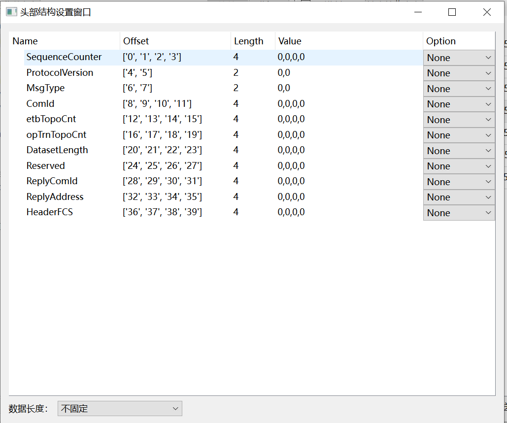
1.输入要发送的值：在弹出的设置头部窗口，value列可输入字段整体值或者使用英文逗号分割每个字节的数值（仅当字段长度大于1个字节时）。缺省值为0。
2.选择可选操作：前置要求中的option列含义进行选择所需操作，默认为不操作。
3.选择数据长度字段：在设置头部窗口，左下角可选择数据长度字段名称，选择后，发送数据时将按照所选择的数据长度字段value值进行消息检查和扩充（如需要），以确保数据长度与规定一致。
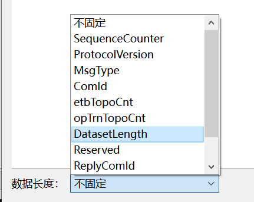
4.其他：头部数据窗口关闭后再次打开可保留上次设置。

#### 消息发送
##### 要求
进行消息发送前，需要保证：a.已选择发送消息自定义部分和头部的csv文件；b.主界面显示与对端为“已连接”状态。如下图：
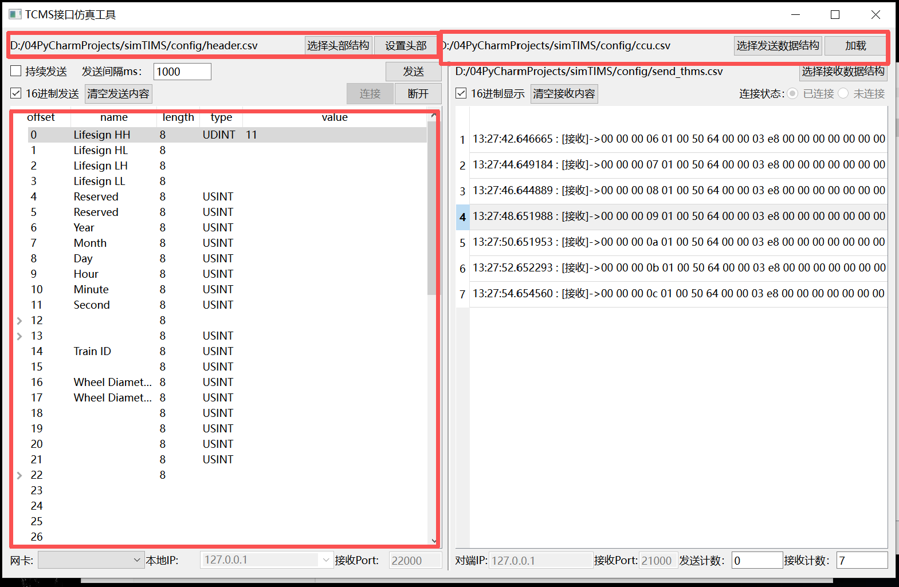
##### 操作说明
1.	单次发送：点击主界面“发送”按钮，即可进行一次消息发送。
2.	持续间隔发送：在主界面输入发送间隔（单位ms），并勾选“持续发送”选项后，软件将按照发送间隔周期发送消息。
